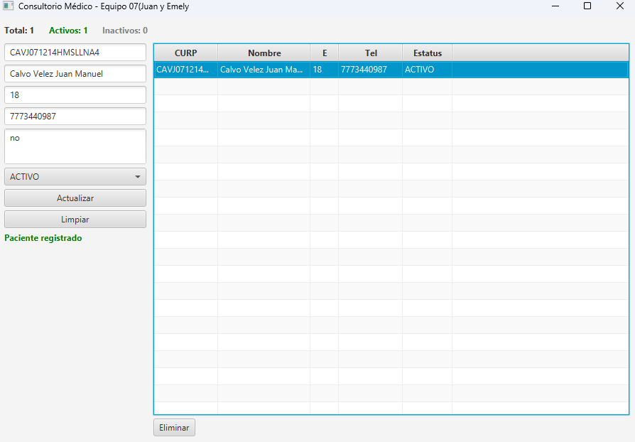

# Directorio de Pacientes - Consultorio Médico (Grupo 2°D)

*Proyecto Integrador:* Aplicaciones de Escritorio / POO  
*Equipo:* 07

##  Contexto y Objetivo
Este sistema de escritorio está diseñado para administrar el directorio de pacientes de un consultorio pequeño. Permite registrar, consultar, actualizar y eliminar pacientes utilizando Programación Orientada a Objetos (POO).

El objetivo principal es implementar un CRUD completo con persistencia de datos en un archivo local (sin base de datos), asegurando que la información se conserve entre ejecuciones.

##  Funcionalidades Principales

### 1. CRUD y Persistencia
* *Alta, Consulta y Actualización* de pacientes.
* *Eliminación y Estatus:* Se utiliza borrado lógico. Los pacientes cambian su estatus a INACTIVO en lugar de ser eliminados físicamente.
* *Persistencia en Archivo:* Los datos se guardan y cargan automáticamente desde un archivo local (.csv), ubicado en la carpeta data.

### 2. Validaciones Implementadas
* No se permiten campos vacíos.
* *CURP:* Único por paciente (no permite duplicados) y editable.
* *Nombre:* Longitud mínima de 5 caracteres.
* *Edad:* Valor numérico en un rango lógico (0 a 120).
* *Teléfono:* Solo dígitos, longitud mínima de 10 caracteres.

### 3. Interfaz Gráfica (JavaFX)
* *Tabla Principal:* Muestra la lista de pacientes registrados.
* *Resumen en Tiempo Real:* Contadores automáticos en pantalla que muestran: Total de pacientes, Activos e Inactivos.
* *Formulario:* Campos para CURP, nombre, edad, teléfono, alergias y estatus. Alertas en pantalla integradas para mostrar mensajes de éxito o errores de validación.

## Tecnologías Utilizadas
* *Lenguaje:* Java
* *Interfaz:* JavaFX (FXML + Controller)
* *Arquitectura:* Patrón de 3 capas (Modelo, Servicio, Repositorio) / POO
* *Estructura de Datos:* ObservableList para el manejo dinámico de la tabla.
* *Control de Versiones:* Git (Flujo Git Flow: ramas main, dev y personales).

##  Cómo ejecutar el proyecto
1. Clonar este repositorio: git clone [https://github.com/20253ds093-collab/utez-2d-pacientes-javafx-equipo07.git]
2. Abrir el proyecto en tu IDE de preferencia (IntelliJ IDEA, Eclipse, NetBeans) que soporte JavaFX.
3. Asegurarse de tener configurado el JDK correspondiente (versión 17 o superior recomendada).
4. Ejecutar la clase principal Launcher.java (o HelloApplication.java dependiendo de la configuración del IDE).
5. El sistema creará automáticamente la carpeta data y el archivo pacientes.csv en la raíz del proyecto al guardar el primer paciente si este no existe.

##  Capturas de Pantalla

